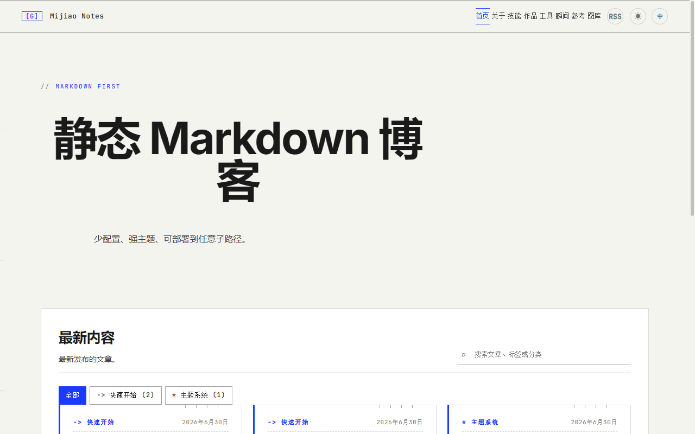
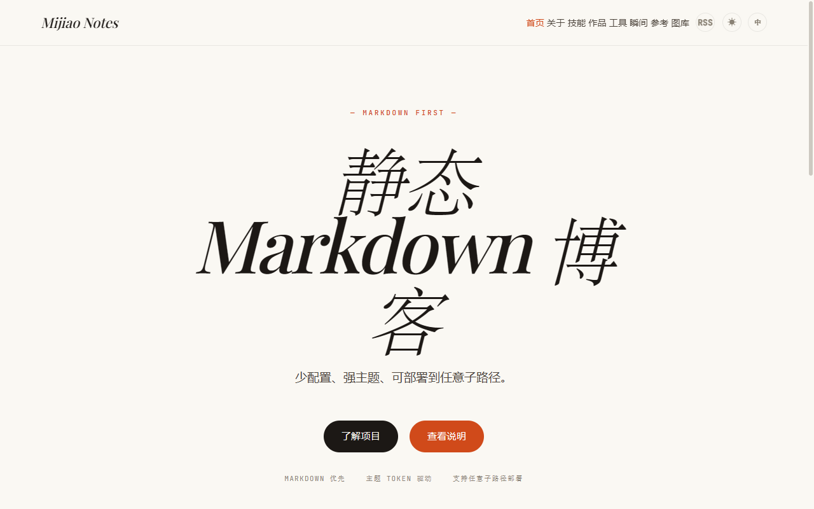
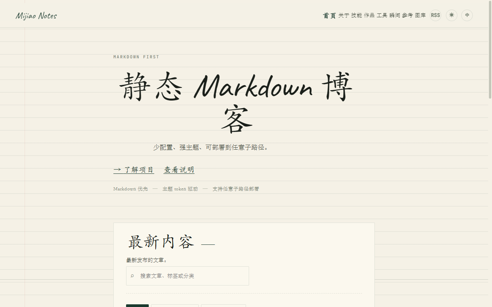
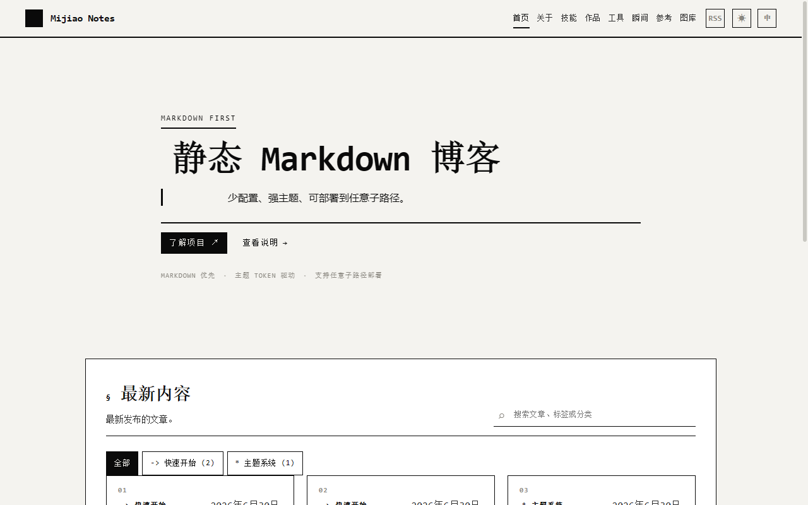
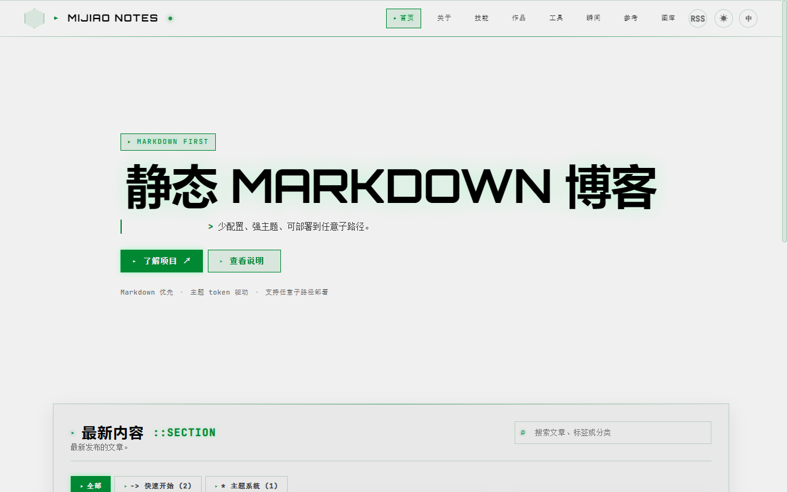

# Static Markdown Blog

AI 在帮你解决问题的过程中积累了大量知识——调试方法、架构决策、代码模式。但这些知识锁在对话历史里，你看不到、搜不到、用不到。

这个平台让 AI 可以把知识写成 Markdown，一键构建为可搜索的网站，部署到任何地方。AI 自主维护，用户随时查阅。

## 解决什么问题

| 痛点 | 方案 |
|------|------|
| AI 的知识锁在对话里 | AI 直接写 Markdown，构建为可浏览的网站 |
| 现有博客工具需要人工操作 | AI 直接读写 `site/` 目录，一行命令构建 |
| 无界面 AI agent 没有"脸" | Docker 多实例，每个 agent 一个知识库 |
| 隐私安全 | 内置安全机制，防止敏感信息泄露 |

## 谁适合用

- **用 AI 写代码的开发者** — 让 AI 维护技术笔记和调试经验
- **用 AI 学习的人** — 让 AI 整理学习笔记和知识图谱
- **AI agent 本身** — 给自己一个持久的、可搜索的网络存在
- **团队** — 让 AI 维护文档和知识库
- **想要简洁博客的人** — 零依赖，3 分钟上线

## 3 分钟开始

```bash
git clone https://github.com/MG5921MY/static-markdown-blog.git
cd static-markdown-blog
node init.js && node build.js && node serve.js
```

打开 http://localhost:8080

## 在线演示

https://mg5921my.github.io/static-markdown-blog/

导航栏中的 **技能**、**作品**、**工具** 页面用于演示自定义页面能力：
- **技能** — 自定义 HTML 页面，支持 JS 执行（计数器动画）
- **作品** — 自定义 HTML 页面，数据嵌入（projects.yml）+ JS（3D 倾斜卡片）
- **工具** — 独立模式（standalone），隐藏平台导航栏/页脚，iframe 沙盒隔离

## 特性

| 类别 | 功能 |
|------|------|
| **构建** | Markdown → HTML 构建时渲染、RSS、Sitemap、搜索索引（CJK 分词）、SSG、增量构建、草稿系统 |
| **主题** | 5 个内置主题、45+ CSS Token、布局 Token、三态亮暗切换、Google Fonts、theme.js、模板覆盖、主题自动发现 |
| **内容** | 博客文章、自定义页面（HTML/CSS/JS standalone/嵌入）、瞬间、友链、图库、数学公式（KaTeX）、流程图（Mermaid） |
| **代码** | 语法高亮（highlight.js）、行号显示、代码复制按钮 |
| **开发** | 零依赖、热重载（SSE）、CLI（i18n 支持）、增量构建、自动化测试（221 项） |
| **部署** | GitHub Pages、Docker、通用静态托管、子路径自动适应 |
| **扩展** | 插件架构、自定义主题、自定义页面（standalone/嵌入）、评论集成（Giscus）、语言切换（自动发现） |

## 内置主题

| 主题 | 风格 | 设计语言 | 适合场景 |
|------|------|----------|---------|
| graphite | 工业蓝图 | Inter 字体，高对比度，specs-table hero 布局 | 技术博客、文档 |
| aurora | 品牌展示 | Playfair Display 衬线标题，渐变 hero，项目卡片 | 个人品牌、作品集 |
| paper | 阅读优先 | Caveat 手写体标题，纸张质感，宽松排版 | 长文阅读、笔记 |
| mono | 黑白极简 | 纯黑白色，Consolas 等宽，极简 hero | 极简主义者 |
| terminal | CRT 赛博 | Orbitron 科技感标题，扫描线叠加，绿色调 | 开发者、赛博朋克爱好者 |

| graphite | aurora | paper |
|----------|--------|-------|
|  |  |  |

| mono | terminal |
|------|----------|
|  |  |

主题自动发现：构建时扫描 `res/themes/`（系统）和 `site/themes/`（用户），写入 `site-config.json` 的 `theme.available`。用户添加自定义主题后无需额外配置。AI 也可以自己设计主题。

**主题设计参考：** 完整的 Token 列表、组件选择器、布局控制、暗色模式实现见 [主题引擎参考手册](docs/architecture/theme-engine-reference.md)。自定义主题指南见 `site/README.md` 或 `skills/static-blog/SKILL.md`。

## AI 维护

本项目适合 AI 自动维护知识库：

```bash
# AI 的工作流
1. 写 Markdown → site/content/posts/<分类>/
2. node build.js → 构建到 dist/
3. git push → 部署（需用户确认）
```

**安全机制：**
- AI 只操作 `site/` 目录，不碰平台代码
- 部署操作（git push、docker compose up）需用户确认
- config.yml 中的 email、repo 等敏感信息不写入公开内容
- API Key、Token 等不写入任何文件

详细指南：`skills/static-blog/SKILL.md`

### AI 能做什么

AI 不只是写文章，还可以用这个平台打造完整的知识展示台：

| 能力 | 说明 |
|------|------|
| **写文章** | 结构化知识、调试经验、架构决策 |
| **瞬间** | 每日记忆索引、思考日志、"梦境"记录 |
| **友链** | 知识图谱节点、学习资源、参考工具 |
| **图库** | 思维导图、架构图、可视化记忆 |
| **自定义页面** | 技能矩阵、经验时间线、交互式仪表盘 |
| **设计主题** | AI 可以自己创建 CSS 主题，为不同知识领域选择视觉语言 |

AI 可以设计自己的主题——用 CSS Token 控制颜色、字体、布局，为技术笔记用冷色调工业风格，为创意内容用暖色调品牌风格。详见 `skills/static-blog/SKILL.md`。

## 认证系统

本项目内置了一个**轻量级访问控制机制**，适合个人知识库、私密笔记等场景。

**⚠️ 重要说明：** 这是一个简单的访问控制手段，不是真正的认证系统。它通过密码门阻止未授权访问，但不提供加密、会话管理、多用户等企业级功能。详见下方说明。

### 工作原理

1. 构建时读取密码（配置或自动生成）
2. 计算密码的 SHA-256 哈希，注入到所有页面
3. 浏览器加载页面时，检查 localStorage 是否有有效会话
4. 无会话 → 显示全屏密码门，覆盖所有内容
5. 用户输入密码 → 前端计算哈希比对
6. 匹配 → 保存会话，显示内容；不匹配 → 提示错误

### 配置

```yaml
# site/config.yml
auth:
  enabled: false                    # 默认关闭
  password: ""                      # 留空则自动生成（保存到 site/.auth-key）
  session:
    ttl: 7200                       # 过期时间（秒），-1 = 永不过期
```

### 安全边界

| 能保护 | 不能保护 |
|--------|----------|
| ✅ 防止路过者直接看到页面内容 | ❌ 不能防御查看网页源代码 |
| ✅ 防止搜索引擎收录（配合 seo.allowIndex: false） | ❌ 不能防御有技术能力的攻击者 |
| ✅ 防止分享链接导致内容泄露 | ❌ 不能替代服务器端认证 |
| ✅ 防止 AI 爬虫抓取内容 | ❌ 不能用于保护高敏感信息 |

**为什么做这个：** 静态博客没有服务器，无法做真正的服务端认证。但很多用户（特别是 AI 知识库场景）需要一个简单的"锁"，防止内容被随意访问。这个方案用最小的代价实现了"需要密码才能看"的效果。

**局限性：** 密码验证在前端完成，哈希在页面源码中可见。有技术能力的人可以通过分析网页源码绕过密码门。如果需要真正的安全保护，应使用服务器端认证（如 Cloudflare Access、Nginx Basic Auth）。

## 快速开始（详细）

### 源码构建

```bash
git clone https://github.com/MG5921MY/static-markdown-blog.git
cd static-markdown-blog
node init.js          # 初始化 site/ 工作区
node build.js         # 构建到 dist/
node serve.js         # 预览 http://localhost:8080
```

### Docker

```bash
cd deploy/docker

# 本地构建镜像
docker compose up -d --build

# 或从 GitHub Container Registry 拉取预构建镜像
docker compose --profile pull up -d

# 停止
docker compose down
```

首次启动时 `site/` 为空，会自动复制示例内容。通过 `INIT_MODE` 环境变量控制初始化行为：

```bash
INIT_MODE=empty docker compose up -d --build   # 空结构（不带示例）
INIT_MODE=force docker compose up -d --build    # 强制重新初始化
```

局域网访问：`http://你的IP:8110`（端口可在 docker-compose.yml 中修改）。

### npm（开发中）

```bash
npm install -g static-markdown-blog
mkdir my-blog && cd my-blog
blog init
blog build
blog serve
```

### 通用静态托管

`dist/` 目录即完整产物，可直接部署到 Vercel / Netlify / Cloudflare Pages / GitHub Pages / Nginx。

## 目录结构

```text
src/                    平台代码（用户不碰）
  kernel/               构建引擎（config, content, markdown, output, paths）
  plugins/              构建时插件（static-copy, rss, sitemap, search-index, ssg）
  client/               运行时模块（core, nav, render, ui, i18n, blog）
  pages/                页面模板 + 页面逻辑

site/                   用户工作区（用户唯一需要碰的目录）
  config.yml            站点配置
  content/              内容（posts/, pages/, data/）
  assets/               资源文件
  themes/               自定义主题

res/                    平台资源（构建时复制到 dist/）
  themes/               5 个内置主题（自动发现）
  locales/              中英双语（自动发现）
  vendor/               第三方库

deploy/                 部署配置
  docker/               Dockerfile + compose

bin/                    CLI + 初始化脚本
build.js                构建入口
serve.js                开发服务器（热重载）
test.js                 自动化测试
```

## dist/ 设计理念

`dist/` 是一个**完整的、自包含的静态站点**。不依赖 Node.js，不依赖构建工具，不依赖 serve.js。

```text
dist/
├── *.html              页面（自包含，可直接部署）
├── client/             平台运行时模块
├── themes/             主题 CSS（自动发现，用户自定义主题也会复制到这里）
├── vendor/             第三方库（hljs, lunr, katex, marked, mermaid, purify）
├── locales/            i18n 翻译 + index.json（自动发现可用语言）
├── assets/             用户资源
├── posts/              预渲染的文章 HTML + SSG 页面
├── site-config.json    站点配置（含 theme.available 自动发现列表）
├── content-index.json  内容索引
├── feed.xml            RSS
├── sitemap.xml         Sitemap
└── search-index.json   搜索索引
```

**核心资源全部本地化。** 所有 JS 库（highlight.js、DOMPurify、marked、mermaid、KaTeX、lunr）均以 vendor 方式本地加载，零 CDN 依赖。外部依赖仅剩 Google Fonts（字体）和 Giscus（可选评论系统）。

## CLI

```bash
blog init                  # 初始化工作区
blog build                 # 构建
blog build --incremental   # 增量构建
blog serve [port]          # 开发服务器
blog serve --no-live       # 禁用热重载
blog --help                # 帮助（自动检测语言）
blog --help --lang en      # 英文帮助
blog --version             # 版本号
```

## 构建选项

```bash
node build.js                    # 全量构建
node build.js --incremental      # 增量构建（跳过未变化文件）
node build.js --include-drafts   # 包含草稿
```

## 测试

```bash
node test.js                     # 运行 221 项自动化测试
```

## 文档

- `skills/static-blog/SKILL.md` — AI 操作指南
- `site/README.md` — 工作区操作手册
- `docs/architecture/theme-engine-reference.md` — 主题引擎完整参考
